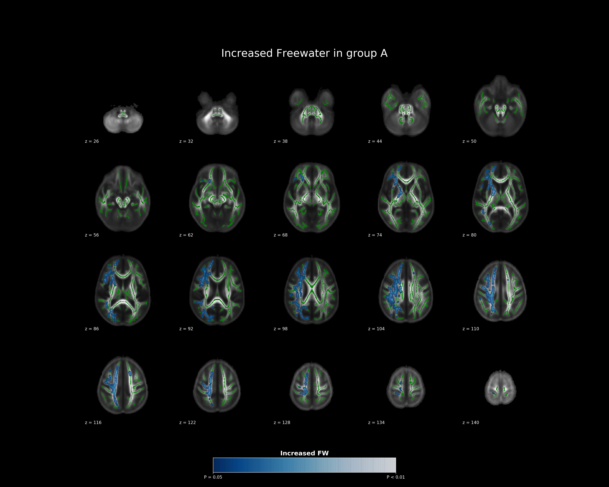
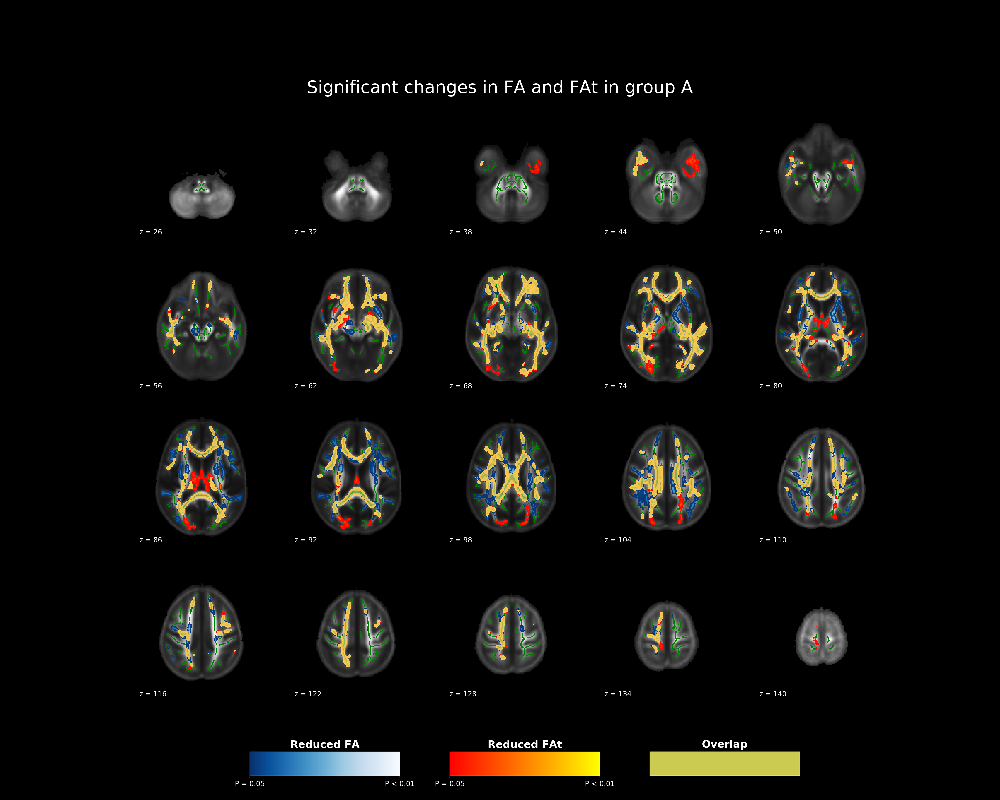

 

# nifti-snapshot

Tools used to summarize nifti files into figures.

```py
git clone https://github.com/pnlbwh/nifti-snapshot
```


## Contents

- TODO
- Dependencies
- TBSS figures


## TODO

- test script
- add different background image options
- 4d map summary (diffusion)
- ROI & multi ROI visualization
- project wise examples


## Dependencies

```py
FSLDIR in PATH
ENIGMA_dir in PATH 
# download from http://enigma.ini.usc.edu/wp-content/uploads/2013/02/enigmaDTI.zip

python 3.7
scipy==1.3.3
nibabel==2.4.0
numpy==1.16.2
pathlib2==2.3.3
matplotlib==3.0.3
```

## Single image examples

### Link to a single image examples

[Jupyter notebook link](docs/Single_image_example.ipynb)


## TBSS figures

### From commandline

#### Snapshot of an `tbss_fill` image
```sh
fw=tbss_FW_tfce_corrp_tstat2_filled.nii.gz

./nifti_snapshot \
    --input ${fw} \
    --tbss \
    --output_file cli_test_fw.png \
    --cmap "Blues_r" \
    --title "Significant changes in FW in group A" \
    --cbar_title 'Increased FW' 
```




<br>

#### Snapshot of two `tbss_fill` images with overlap highlight

```shell
fa=tbss_FA_tfce_corrp_tstat1_filled.nii.gz
fat=tbss_FAt_tfce_corrp_tstat1_filled.nii.gz

./nifti_snapshot \
    --input ${fa} ${fat} \
    --tbss \
    --output_file cli_test.png \
    --cmap "Blues_r" "autumn" \
    --title "Significant changes in FA and FAt in group A" \
    --cbar_title 'Reduced' 'Reduced FAt' 'Overlap' \
    --overlap \
    --overlap_cmap "summer" \
    --overlap_alpha 0.8
```




---


### From python

#### Snapshot of an `tbss_fill` image

```py
from nifti_snapshot import nifti_snapshot
fw = 'tbss_FA_tfce_corrp_tstat1_filled.nii.gz'
fw_color = 'Blues_r'

tbssFigure = nifti_snapshot.TbssFigure(
        image_files=[fw],
        output_file='docs/fw_example.png',
        cmap_list=[fw_color],
        cbar_titles=['Increased FW'],
        alpha_list=[0.8],
        title='Increased Freewater in group A',
        cbar_x=0.35, cbar_width=0.3)
tbssFigure.create_figure_one_map()
```

#### Snapshot of two `tbss_fill` images with overlap highlight

```py
from nifti_snapshot import nifti_snapshot
fa = 'tbss_FA_tfce_corrp_tstat1_filled.nii.gz'
fat = 'tbss_FAt_tfce_corrp_tstat1_filled.nii.gz'

fa_color_1 = 'Blues_r'
fa_color_2 = 'autumn'
fa_color_overlap = 'summer'

tbssFigure = nifti_snapshot.TbssFigure(
    image_files=[fa, fat],
    output_file='docs/fa_fat_example.png',
    cmap_list=[fa_color_1, fa_color_2],
    overlap_cmap=fa_color_overlap,
    cbar_titles=[
        'Reduced FA',
        'Reduced FAt',
        'Overlap'],
    alpha_list=[1, 1, 0.8],
    title='Significant changes in FA and FAt in group A')
tbssFigure.create_figure_two_maps_and_overlap()
```


