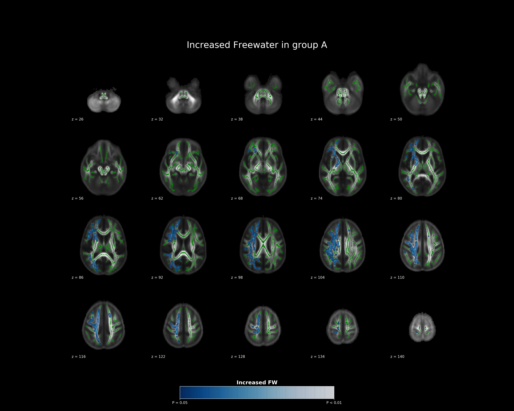
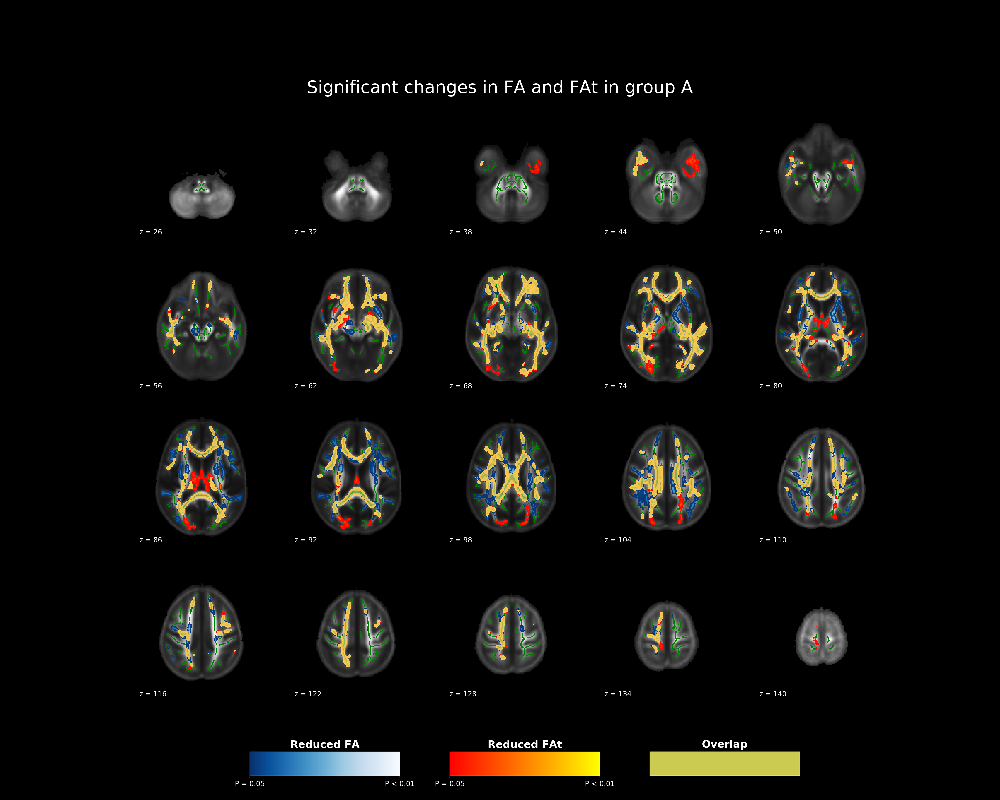

More examples
=============

Using ``nifti-snapshot`` from shell
-----------------------------------

TBSS figures
~~~~~~~~~~~~

**Snapshot of an ``tbss_fill`` image** 

This would be the most simple, and maybe most useful way of capturing TBSS
outputs. The assumption in this function is that the TBSS was ran with ENIGMA
FA template as the standard. ::

    $ fw=tbss_FW_tfce_corrp_tstat2_filled.nii.gz

    $ nifti_snapshot \
        --input ${fw} \
        --tbss \
        --output_file cli_test_fw.png \
        --cmap "Blues_r" \
        --title "Significant changes in FW in group A" \
        --cbar_title 'Increased FW' 

The ``cmap`` option used in ``nifti_snapshot`` is based on the `matplotlib
colormaps <https://matplotlib.org/stable/tutorials/colors/colormaps.html>`_,
so you could also experiment using different colormaps.

Just for your information, look `here <https://fsl.fmrib.ox.ac.uk/fsl/fslwiki/TBSS/UserGuide#Displaying_TBSS_Results>`_
to see how ``tbss_filled`` images could be created.

Output figure looks as following.

**Snapshot of two `tbss_fill` images with overlap highlight** 

It is uncommon to visualize two different modalities together from TBSS, but it
could be useful if one wants to investigate shared or unique information
contained in each modality. For example, visualizing ``FA`` maps and ``FAt``
maps together may prove helpful to investigate the effect of Freewater modeling
in finding different regions detected by each modality.::

    fa=tbss_FA_tfce_corrp_tstat1_filled.nii.gz
    fat=tbss_FAt_tfce_corrp_tstat1_filled.nii.gz

    nifti_snapshot \
        --input ${fa} ${fat} \
        --tbss \
        --output_file cli_test.png \
        --cmap "Blues_r" "autumn" \
        --title "Significant changes in FA and FAt in group A" \
        --cbar_title 'Reduced' 'Reduced FAt' 'Overlap' \
        --overlap \
        --overlap_cmap "summer" \
        --overlap_alpha 0.8

As you can see in the code above, it takes in two ``--cmap`` options for each
modality. And for regions that overlap between the two modalities, colormap
defined through ``--overlap_cmap`` option would be used.

Calling ``nifti-snapshot`` from python
---------------------------------------

::

    from nifti_snapshot import nifti_snapshot
    fw = 'tbss_FA_tfce_corrp_tstat1_filled.nii.gz'
    fw_color = 'Blues_r'

    tbssFigure = nifti_snapshot.TbssFigure(
            image_files=[fw],
            output_file='docs/fw_example.png',
            cmap_list=[fw_color],
            cbar_titles=['Increased FW'],
            alpha_list=[0.8],
            title='Increased Freewater in group A',
            cbar_x=0.35, cbar_width=0.3)
    tbssFigure.create_figure_one_map()

::

    from nifti_snapshot import nifti_snapshot
    fa = 'tbss_FA_tfce_corrp_tstat1_filled.nii.gz'
    fat = 'tbss_FAt_tfce_corrp_tstat1_filled.nii.gz'

    fa_color_1 = 'Blues_r'
    fa_color_2 = 'autumn'
    fa_color_overlap = 'summer'

    tbssFigure = nifti_snapshot.TbssFigure(
        image_files=[fa, fat],
        output_file='docs/fa_fat_example.png',
        cmap_list=[fa_color_1, fa_color_2],
        overlap_cmap=fa_color_overlap,
        cbar_titles=[
            'Reduced FA',
            'Reduced FAt',
            'Overlap'],
        alpha_list=[1, 1, 0.8],
        title='Significant changes in FA and FAt in group A')
    tbssFigure.create_figure_two_maps_and_overlap()
