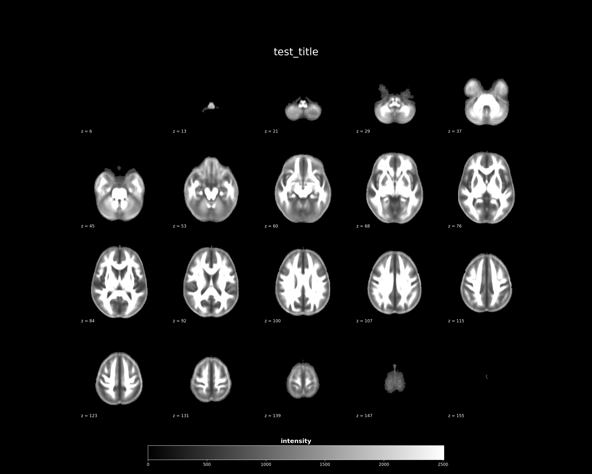

Quick start
===========

``nifti-snapshot`` is a tool to quickly capture nifti image as a ``png`` or
``jpg`` figures.

Installation
------------

Install the ``nifti-snapshot``
~~~~~~~~~~~~~~~~~~~~~~~~~~~~~~

EasInstall ``nifti-snapshot`` using ``pip`` ::

    $ pip install nifti_snapshot

.. note ::

   It's ``_``, not ``-`` when using the ``pip``

For the most recent version of ``nifti_snapshot``, you could pull the most
recent branch from `github repository <https://github.com/pnlbwh/nifti-snapshot>`_.

::

    $ git clone https://github.com/pnlbwh/nifti-snapshot

ENIGMA nifti data
~~~~~~~~~~~~~~~~~

**Download ENIGMA data**

``nifti-snapshot`` requires nifti maps that ENIGMA published. It can be
downlaoded by executing the command below ::

    $ enigma_data_dir=${HOME}/enigma_data   # change this if you want to 
    $ mkdir -p ${enigma_data_dir}
    $ wget http://enigma.ini.usc.edu/wp-content/uploads/2013/02/enigmaDTI.zip -P ${enigma_data_dir}
    $ unzip -o -d ${enigma_data_dir} ${enigma_data_dir}/enigmaDTI.zip

**Set up PATH environment**

Add below line to your bashrc (``~/.bashrc``) or execute it everytime you use
``nifti-snapshot``. ::

    export enigma_data_dir=${HOME}/enigma_data   # change this if you want to 
    

**Check installation**
::

    $ nifti_snapshot -h

.. note ::

   If you have downloaded nifti-snapshot from its github repository, you will
   also have to add path of the ``nifti_snapshot/script`` to your ``PATH`` and
   ``nifti_snapshot/nifti_snapshot`` to your ``PYTHONPATH`` variable to access
   ``nifti_snapshot`` executable from any location.

   ::

      export PYTHONPATH=${PATH}:${HOME}/nifti_snapshot/nifti_snapshot
      export PATH=${PATH}:${HOME}/nifti_snapshot/script

Test create an image
--------------------

::

    $ nifti_snapshot \
        --input ${enigma_data_dir}/ENIGMA_DTI_FA.nii.gz \
        --title test_title \
        --output_file t1w_test.png

Congratulations!
